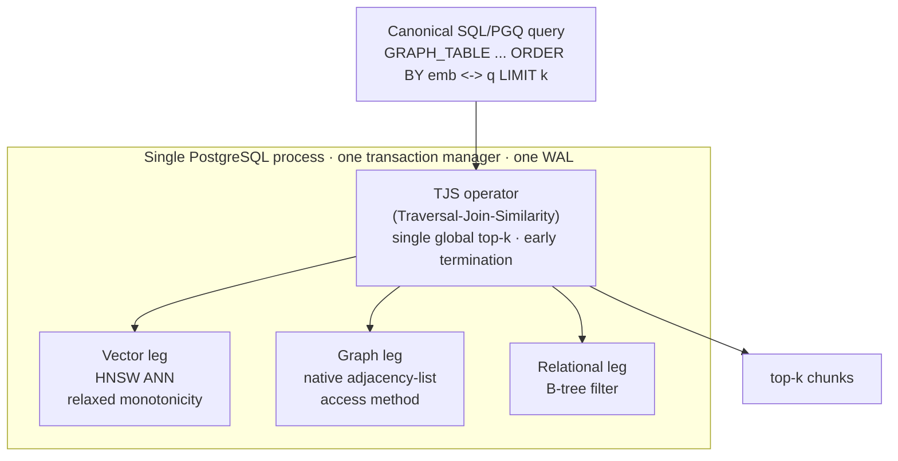

<!-- Banner / logo. TODO: add ./assets/banner-{light,dark}.svg and uncomment.
<p align="center">
  <picture>
    <source media="(prefers-color-scheme: dark)" srcset="./assets/banner-dark.svg">
    <source media="(prefers-color-scheme: light)" srcset="./assets/banner-light.svg">
    
  </picture>
</p>
-->

<h1 align="center">TriDB</h1>

<p align="center">
  <strong>Collapse your RAG stack into one Postgres: vector search, graph traversal, and relational filtering in a single query plan — three extensions on stock PostgreSQL 16/17.</strong>
</p>

<p align="center">
  <a href="#license"></a>
  <a href="https://github.com/ConsultingFuture4200/tridb/actions/workflows/ci.yml"></a>
  <a href="#benchmarks"></a>
  <a href="spec/tridb_spec_v0.1.0.md"></a>
</p>

<p align="center">
  
  
  
  
  
</p>

---

**Current release: v0.2.0** — [release notes](docs/releases/v0.2.0.md) · [install guide](docs/INSTALL_stock_pg.md) · extensions install on **stock PostgreSQL 16/17 + pgvector**, no fork.

<p align="center">
  
  <br>
  <em>Measured live (warm, client-clocked, all-localhost — the multi-store's <b>best</b> case): the same
  1-hop fused query over 200,000 Wikipedia articles / 14.7M hyperlinks, recall 1.0 on both sides,
  every query shown. Per-query data:
  <a href="bench/results/wiki_fusion_race_v0.1.0.json">bench/results/wiki_fusion_race_v0.1.0.json</a> ·
  method: <a href="docs/benchmark_wiki_fusion_v0.1.0.md">the fusion benchmark</a>.</em>
</p>

## Try It

One command to a running tri-modal Postgres (stock PG + pgvector + the TriDB extensions, prebaked):

```bash
docker build -f scripts/pg17/Dockerfile.release -t tridb/postgres-trimodal:pg17 .
docker run -d --name trimodal -e POSTGRES_PASSWORD=secret tridb/postgres-trimodal:pg17
docker exec -it trimodal psql -U postgres \
  -c 'CREATE EXTENSION vector;' \
  -c 'CREATE EXTENSION graph_store_am;' \
  -c 'CREATE EXTENSION tjs_pg;'
```

Or use it as **agent memory over MCP** (store / connect / recall through the fused operator — [docs](docs/mcp_agent_memory_v0.1.0.md)):

```bash
pip install -r requirements-mcp.txt
make mcp-demo        # container up -> store/connect/recall over real stdio JSON-RPC -> teardown
```

A recording of this session against the 200k-article Wikipedia corpus (stored memories and
articles in one graph, fused recall pulling a linked article in) is in the
[MCP docs](docs/mcp_agent_memory_v0.1.0.md).

### Proven, at what scale

| Claim | Scale it was measured at | Evidence |
|---|---|---|
| Fused filter-first query **23.68×** faster than Milvus+Neo4j+Postgres at matched recall (0.992/0.986), on stock PG 17 | 1,002,331-entity Wikidata slice | [`docs/gate_b_spike_v0.1.0.md`](docs/gate_b_spike_v0.1.0.md) |
| Fused seedless retrieval **3.3–16.7×** faster than the app-side multi-store pipeline at matched recall@10 | 200k Wikipedia articles, 14.68M hyperlink edges | [`docs/benchmark_wiki_fusion_v0.1.0.md`](docs/benchmark_wiki_fusion_v0.1.0.md) |
| One-WAL consistency: **0** torn cross-store writes under injected failure (baseline 42/42); torn reads 1.0% vs 76.7% | live crash/failure harness, same corpus | [`docs/benchmark_wiki_consistency_v0.1.0.md`](docs/benchmark_wiki_consistency_v0.1.0.md) |
| PPR-graded seedless default beats reachability scoring: **+47% rel** link-pred recall@20; **+4.7 pt** HotpotQA recall@5 | 200k/14.68M-edge enwiki + HotpotQA | [ADR-0021](docs/decisions/0021-ppr-default-graph-scoring.md) |
| Graph-bridge injection lifts multi-hop joint evidence recall@5 by **+15.6 pt** over vector-only (reproducible host-side, pinned data) | HotpotQA dev slice | [`docs/benchmark_public_repro_v0.1.0.md`](docs/benchmark_public_repro_v0.1.0.md) |
| **Honest tie we published anyway:** plain SQL in the *same* Postgres (pgvector + a tuned `links` CTE) comes within 16 µs of the fused operator at the anchored query class — the big win is one-system-vs-three; at the pure filtered-ANN class plain pgvector still leads on median (1.3–1.6× after two fix rounds; tails now bounded below pgvector's — [#32](https://github.com/ConsultingFuture4200/tridb/issues/32)) | same 1M Wikidata slice, same DB, same session | [`docs/benchmark_allpg_baseline_v0.1.0.md`](docs/benchmark_allpg_baseline_v0.1.0.md) |

**Not yet measured:** the 128 GB headline benchmark (GX10-gated) and the 1M seedless head-to-head (blocked; documented in the fusion doc). Honest-limits list: [release notes](docs/releases/v0.2.0.md#honest-limits--read-before-benchmarking).

<details>
<summary>Table of Contents</summary>

- [Try It](#try-it)
- [About](#about)
- [Features](#features)
- [Architecture](#architecture)
- [Benchmarks](#benchmarks)
- [The Canonical Query](#the-canonical-query)
- [Quick Start](#quick-start)
- [Repository Layout](#repository-layout)
- [Status](#status)
- [License](#license)

</details>

## About

"Omni-RAG" retrieval needs three things at once: **similarity** (which chunks are relevant?), **traversal** (what's connected to them?), and **filtering** (which are in scope?). The usual answer stitches three systems together (a vector DB, a graph DB, and a relational DB) and merges results in application code. That **materialize-transfer-prune** cycle ships large intermediate sets across process boundaries on every turn.

TriDB collapses all three into **one query plan, in one PostgreSQL process, under one transaction manager**. The win isn't better individual retrievers. It's enforcing the global top-k *during* execution so intermediate results never blow up. It is a clean-room implementation of **AkasicDB** (SIGMOD Companion '26), built by forking **MSVBASE** (VBASE, OSDI '23) and adding a native graph store, extending **Chimera**'s (PVLDB 18(2)) dual-store design to a triple store.

**Why this exists vs. AkasicDB:** AkasicDB is the design TriDB descends from; TriDB is an **open, Postgres-native, locally-runnable** realization of it: it runs on a single DGX Spark, the whole stack is reproducible from this repo, and it leans on the pgvector/Postgres ecosystem rather than a closed system. The peer-reviewed lineage (VBASE / AkasicDB / Chimera) is the credibility anchor; the open + local + reproducible angle is the contribution.

**Installable on stock Postgres (D2 un-fork):** the native graph store (`graph_store_am`) and the fused `tjs_open` operator (`src/tjs_pg`) now install as **plain extensions on stock PostgreSQL 16/17 + pgvector** — no forked Postgres required (see [`docs/INSTALL_stock_pg.md`](docs/INSTALL_stock_pg.md), ADR-0019). The MSVBASE fork (PG 13.4) remains the **reference vehicle**: it holds the relaxed-monotonicity executor mechanism the seedless SM-4 recall curve is measured against, but it is the launch vehicle, not the destination. The stock-PG filter-first path already **measures a larger fusion win than the fork** (Gate B below).

> [!NOTE]
> **What v1 actually delivers (read before benchmarking):** TriDB wins decisively on **source-anchored
> tri-modal queries** ("given entity X, find vector-similar entities reachable from X, filtered") and on
> **one-WAL transactional consistency across all three stores**, a guarantee a bolt-on
> Milvus+Neo4j+Postgres stack cannot make. The open-domain retriever is now a real engine operator
> (first-cut): the single-source `tjs()` operator ranks vectors only within one source's reachable set,
> while the seedless multi-seed **`tjs_open` operator (ADR-0012) ships as a first-cut**: seedless ANN
> seeding + multi-source graph expansion + bridge injection past the vector frontier (TR-1-preserving),
> at **recall@10 0.980 on real HotpotQA** (vs 0.967 vector-only). It uses reachability-bridge injection +
> VBASE early termination; the PPR-graded + rank-join-fusion refinement (host-validated at 0.987,
> `bench/tjs_open_ref.py`) is the next iteration. The cross-modal join-order heuristic is **live**: the
> filter-first physical body shipped (DEV-1290) and the FR-6 lowering binds the decision to execution
> (DEV-1285), so a selective predicate at scale runs filter-first: at 1M this drops the canonical
> query from ~171 ms (vector-first) to single-digit ms at recall 1.0 (see benchmarks). Lead with the
> source-anchored + consistency wins; the open-retrieval operator is real but first-cut.

## Features

- **Tri-modal in one plan** — vector + graph + relational compose in a single Volcano pipeline via the **TJS** (Traversal-Join-Similarity) operator, with a single global top-k.
- **Native graph store** — topology is a first-class adjacency-list **PostgreSQL access method** (32 KB pages, GenericXLog, crash/abort-durable), *not* relational join tables.
- **One transaction manager, one WAL** — the graph store lives inside the Postgres process, so a single transaction commits/rolls back atomically across all three stores (FR-7). No second WAL, no cross-system transactions.
- **Early termination everywhere (TR-1)** — every operator honors Open/Next/Close and stops as soon as the top-k is settled. No blocking operator is allowed to materialize a full intermediate result.
- **Standard query surface** — the one canonical query is plain SQL/PGQ `GRAPH_TABLE(...)` + pgvector `<->`, lowered to the `tjs()` operator. No new query language.
- **Cross-modal join ordering** — a selectivity heuristic chooses filter-first vs. vector-first to keep the intermediate working set small.

## Architecture



Contrast with the baseline TriDB is measured against, **out-of-DB integration** (AkasicDB Scenario 2): Milvus + Neo4j + Postgres as three separate systems, three transaction managers, results merged in Python. That separation is what forces the intermediate-result blowup and the cross-system round-trips.

## Benchmarks

Head-to-head against the multi-system baseline (Milvus + Neo4j + Postgres, app-side merge) on an **identical corpus and query set** (2000 entities, 12 queries, k=5). Both sides measured like-for-like (warm client wall-clock, median of runs). Run it yourself with `make sm2` and `make bench-live`.

| Metric | Meaning | Target | Result |
|--------|---------|--------|--------|
| **SM-1** | Intermediate-result reduction vs. baseline | ≥ 5× | **1.07× FAIL** (standin; corrected `max(k, reached)` — see [`docs/benchmark_results_v0.1.0.md`](docs/benchmark_results_v0.1.0.md); not restored by GX10) |
| **SM-2** | Lower end-to-end latency than baseline | ≥ 80% of queries | **100% (12/12), median 15.1× (2k/dim-32, x86 standin; re-measure at corrected operating point = DEV-1284, pending)** |
| **SM-3** | Corpus examined (k=5, worst case) | < 25% | **6.4%** |
| **SM-4** | Answer-set parity vs. exact oracle | ≥ 99% | **curve, not a point** (see note ↓) |
| **SM-5** | Transaction atomicity across all stores | 100% | **100%** |

> [!IMPORTANT]
> **SM-4 is a recall/effort curve. Read it honestly.** At the 2k/dim-32 standin scale the qualifying
> rows sit in the top-50, so SM-4 reads 100%; that is *not* the at-scale number. At **100k/dim-768 on
> the GX10 (NEON)** SM-4 trades recall for effort via `term_cond`: **58.5%** exact-parity at the shipped
> default (`term_cond=50`, 3.6% examined) → **97.2%** (`term_cond=5000`) → **100%** (`term_cond=10000`,
> 20.1% examined, still under the 25% TR-1 ceiling). Pin a `term_cond` per reported metric; do **not**
> mix the default-`term_cond` latency number with the high-`term_cond` recall number. (SM-2's "100%"
> means 100% of queries had *lower latency*; the recall metric is SM-4.)

> [!NOTE]
> These are measured on an **x86_64 standin** at standin scale (~1–2 ms/query vs. the baseline's ~16–20 ms). The **128 GB headline benchmark** runs only on the GX10 target (ARM64 + CUDA) and is not yet run. Full methodology and caveats: [`docs/benchmark_sm2_v0.1.0.md`](docs/benchmark_sm2_v0.1.0.md) and [`docs/benchmark_results_v0.1.0.md`](docs/benchmark_results_v0.1.0.md).

### Reproduce the benchmark (one command, public data)

One command runs TriDB's retrieval against **recognized public datasets** and grades **recall@k against an exact oracle**: pinned data (SHA256), pinned seeds. The recall headline reproduces on a commodity x86 box (no engine, no GPU): on the **HotpotQA** dev slice, injecting real graph bridges lifts multi-hop **joint** evidence recall@5 by **+15.6 pt** over vector-only. Live `tjs()` latency stays GX10-gated and is never fabricated.

```bash
make fetch-hotpot HOTPOT_Q=150 && make graphrag    # HotpotQA dev slice + BGE-768 graph (network-gated)
make fetch-dataset PUBLIC_DATASET=sift-128-euclidean   # pinned SIFT1M public-ANN set
make bench-repro                                    # grade recall@k vs exact oracle -> JSON + table
```

Full writeup, the tuned "beat it" baseline, and the honest real-vs-gated split: [`docs/benchmark_public_repro_v0.1.0.md`](docs/benchmark_public_repro_v0.1.0.md).

## The Canonical Query

TriDB targets one locked query template for v1, assembled from existing SQL/PGQ + pgvector standards, no new syntax:

```sql
SELECT chunk
FROM GRAPH_TABLE ( MATCH (src:entity)-[:related_to]->(dst:entity)
  COLUMNS ( src.embedding AS src_embedding,
            dst.chunk     AS chunk,
            dst.timestamp AS timestamp ) )
WHERE timestamp IN :selected_time_range
ORDER BY src_embedding <-> :question_embedding
LIMIT 5;
```

The template is carried verbatim (as text) through the front door `graph_store.graph_query($$...$$)`, which lowers it to a single fused-operator call that drives all three legs with one global top-k: the fork's `tjs()` where installed, or `tjs_open()` (extension `tjs_pg`) on stock PostgreSQL 16/17. Off-template text is rejected — one canonical query for v1.

```sql
SELECT * FROM graph_store.graph_query($$
    SELECT chunk
    FROM GRAPH_TABLE ( MATCH (src:entity)-[:related_to]->(dst:entity)
      COLUMNS ( src.embedding AS src_embedding, dst.chunk AS chunk, dst.timestamp AS timestamp ) )
    WHERE src.id = 1 AND timestamp IN (100)
    ORDER BY src_embedding <-> '[19,0,0,0,0,0,0,0]'
    LIMIT 5
$$);
```

## Quick Start

### Install on stock PostgreSQL 16/17 (recommended)

The graph store and the fused operator install as plain extensions on **stock PostgreSQL 16 or 17 + pgvector** — no fork. Full guide: [`docs/INSTALL_stock_pg.md`](docs/INSTALL_stock_pg.md).

```bash
docker build -f scripts/pg17/Dockerfile.release -t tridb/postgres-trimodal:pg17 .
docker run -d --name trimodal -e POSTGRES_PASSWORD=secret tridb/postgres-trimodal:pg17
docker exec -it trimodal psql -U postgres \
  -c 'CREATE EXTENSION vector;' \
  -c 'CREATE EXTENSION graph_store_am;' \
  -c 'CREATE EXTENSION tjs_pg;'
```

### Build the dev/engine layers (advanced)

> [!IMPORTANT]
> The **128 GB headline benchmark** and the **ARM64 fork build sign-off** target the **GX10 (ARM64 + CUDA, 128 GB)**. The MSVBASE fork also builds and runs on an x86_64 standin via Docker for development; the graph AM additionally builds on stock PG 16/17 off-GX10 (`scripts/pg17_graph_test.sh`).

The repository has two layers. The hardware-independent layer (design, tooling, harnesses, Python tests) runs anywhere:

```bash
python3 -m venv .venv && . .venv/bin/activate
pip install -r requirements.lock   # pinned, reproducible; requirements.txt holds floors only
# pip install -r requirements-vdbb.txt   # optional: only for the VectorDBBench adapter (bench/vdbb_tridb.py)
cp .env.example .env               # documents every env var the tooling reads
make test          # Python + lint layer — fast, no Docker
make lint
```

The engine layer needs the forked-MSVBASE image (`tridb/msvbase:dev`):

```bash
scripts/x86build.sh --docker   # build the fork image (x86_64 standin)
make test-all                  # test + lint + smoke + graph engine suites
make bench-live                # live SM-1/SM-3/SM-4/SM-5 on the real engine

make baseline-up               # stand up Milvus + Neo4j + Postgres baseline
make sm2                       # fair SM-2 latency head-to-head (needs PGPORT=5433 where baseline PG maps to 5433)
make baseline-down
```

On the GX10 target:

```bash
scripts/gx10build.sh           # ARM64 + CUDA build of the MSVBASE fork
```

## Repository Layout

```text
spec/        Versioned spec mirror (source of truth: Linear doc TriDB)
docs/        Design specs, ADRs (docs/decisions/), benchmark results
scripts/     Build scripts (x86build.sh, gx10build.sh) + patch layer
src/         graph_store/ (native access method) + planner/ (join order)
tools/       Synthetic Omni-RAG corpus generators
baseline/    Milvus + Neo4j + Postgres multi-system baseline (DEV-1171)
bench/       TriDB benchmark harness + reports (DEV-1172/1173)
test/        Engine SQL suites (graph, tri-modal, canonical, FR-7)
tests/       Python unit tests (harness, planner, corpus)
```

## Status

Active development, tracked in Linear project **TriDB**. The **v1 tri-modal core** (native graph store, single-source TJS operator, SQL/PGQ surface, HNSW vector durability, one-WAL atomicity) is built and the **GX10 ARM64 build + engine suite are signed off** (the fork builds and the full suite passes on the DGX Spark; the first at-scale run found and fixed a TJS early-termination scale defect; see the SM-4 curve above). **Honestly scoped:** the seedless `tjs_open` multi-seed operator (ADR-0012, the open-GraphRAG retriever) now **ships as a first-cut engine operator**: recall@10 0.980 on real HotpotQA (beating vector-only 0.967) via reachability-bridge injection + VBASE early termination; the PPR-graded + rank-join-fusion refinement (host-validated at 0.987) is the next iteration. The cross-modal join-order heuristic is now **live**: the filter-first physical body shipped (DEV-1290) and the FR-6 lowering binds it to execution (DEV-1285); the **128 GB headline benchmark** and the honest SM-2 re-measurement at the corrected operating point (DEV-1284) are pending.

**D2 un-fork (landed):** the graph AM and the fused `tjs_open` operator (`src/tjs_pg`, ADR-0019) now install on **stock PostgreSQL 16/17 + pgvector**, exercised off-GX10 by the always-on `stock-pg` CI matrix (PG 16 + 17, x86_64). The fusion win reproduces off the fork: **Gate A PASS** — 11.90× on the PG 13.4 fork — and **Gate B PASS** — **23.68×** for the filter-first fused query on stock PG 17 + pgvector at matched recall (0.992/0.986), both on the same pinned 1M slice. See [`docs/tridb_productization_roadmap_v0.1.0.md`](docs/tridb_productization_roadmap_v0.1.0.md) (Addenda A1–A3) for the strategy, [`docs/STATUS.md`](docs/STATUS.md) for the per-issue breakdown, and [`advisor-plans/`](advisor-plans/) for scoped improvement plans.

## License

[MIT](LICENSE), consistent with the upstream [`microsoft/MSVBASE`](https://github.com/microsoft/MSVBASE) base, whose derived portions remain under Microsoft's MIT copyright.


# LOCOMO and LongMemEval

## 1. Start the existing local PostgreSQL cluster

From the repository root:

cd /local-scratch/localhome/hza214/tridb

export PG_CONFIG=/usr/bin/pg_config
export PG_BIN="$("$PG_CONFIG" --bindir)"
export PGDATA="$PWD/.tridb-pgdata"
export PGPORT=55432

"$PG_BIN/pg_ctl" \
  -D "$PGDATA" \
  -l "$PGDATA/server.log" \
  -o "-p $PGPORT -c listen_addresses=127.0.0.1 -c unix_socket_directories=$PGDATA" \
  -w start

Do not run initdb: .tridb-pgdata is already initialized as PostgreSQL 16.

The existing cluster appears to have been initialized by your Unix user, so connect as that user:

export PGUSER="$(id -un)"

"$PG_BIN/psql" \
  -h 127.0.0.1 -p "$PGPORT" -U "$PGUSER" -d postgres \
  -c 'SELECT version();'

## 2. Create the extensions

The installed PG 16 tree already contains all three extension libraries. Create them in dependency order:

"$PG_BIN/psql" \
  -h 127.0.0.1 -p "$PGPORT" -U "$PGUSER" -d postgres \
  -c 'CREATE EXTENSION IF NOT EXISTS vector;' \
  -c 'CREATE EXTENSION IF NOT EXISTS graph_store_am;' \
  -c 'CREATE EXTENSION IF NOT EXISTS tjs_pg;'

Verify:

"$PG_BIN/psql" \
  -h 127.0.0.1 -p "$PGPORT" -U "$PGUSER" -d postgres \
  -c "SELECT extname, extversion
      FROM pg_extension
      WHERE extname IN ('vector', 'graph_store_am', 'tjs_pg')
      ORDER BY extname;"

Only vector is required by these two adapters. The other extensions confirm that this is the complete TriDB installation.

If you need to rebuild the extensions first:

make -C pgvector PG_CONFIG="$PG_CONFIG"
sudo make -C pgvector PG_CONFIG="$PG_CONFIG" install

make -C src/graph_store PG_CONFIG="$PG_CONFIG"
sudo make -C src/graph_store PG_CONFIG="$PG_CONFIG" install

make -C src/tjs_pg PG_CONFIG="$PG_CONFIG"
sudo make -C src/tjs_pg PG_CONFIG="$PG_CONFIG" install

See docs/INSTALL_stock_pg.md:24.

## 3. Prepare Python

python3 -m venv .venv
. .venv/bin/activate
pip install -r requirements.lock

export TRIDB_DSN="postgresql://${PGUSER}@127.0.0.1:${PGPORT}/postgres"

The first adapter run may download BAAI/bge-small-en-v1.5 through fastembed. Its output dimension is 384.

## 4. Smoke-test LOCOMO

Point --input at the official locomo10.json:

python -m bench.agent_memory.tridbBackend.locomo_adapter \
  --input /path/to/locomo/data/locomo10.json \
  --output bench/out/locomo_tridb_smoke.json \
  --top-k 10 \
  --limit-samples 1

Then run the full retrieval pass:

python -m bench.agent_memory.tridbBackend.locomo_adapter     --input /localhome/hza214/Mandol/experimental/self_host_benchmarks/locomo/data/locomo10.json    
 --output bench/out/locomo_tridb_smoke.json     --top-k 10     --limit-samples 1

python -m bench.agent_memory.tridbBackend.locomo_adapter \
  --input /localhome/hza214/Mandol/experimental/self_host_benchmarks/locomo/data/locomo10.json \
  --output bench/out/locomo_tridb.json \
  --top-k 10

Each QA item receives:

- tridb_prediction_context
- tridb_prediction_retrieval
- tridb_prediction_prompt

This adapter does not call an answer LLM. To run LOCOMO’s end-to-end QA evaluation, send each tridb_prediction_prompt to your answer model and store the result as
tridb_prediction; then invoke LOCOMO’s evaluator with eval_key="tridb_prediction".

## 5. Smoke-test LongMemEval

Session-level retrieval, matching its official flat-session baseline:

python -m bench.agent_memory.tridbBackend.longmemeval_adapter \
  --input /path/to/longmemeval_s.json \
  --output bench/out/longmemeval_tridb_session_smoke.jsonl \
  --granularity session \
  --retrieve-k 50 \
  --limit 2

Full session-level run:

python -m bench.agent_memory.tridbBackend.longmemeval_adapter \
  --input /path/to/longmemeval_s.json \
  --output bench/out/longmemeval_tridb_session.jsonl \
  --granularity session \
  --retrieve-k 50

Turn-level variant:

python -m bench.agent_memory.tridbBackend.longmemeval_adapter \
  --input /path/to/longmemeval_s.json \
  --output bench/out/longmemeval_tridb_turn.jsonl \
  --granularity turn \
  --retrieve-k 50

By default, LongMemEval indexes user turns only, matching the official flat baseline. --include-assistant is a separate corpus variant and should be reported as such.

The produced JSONL can feed LongMemEval’s src/generation/run_generation.py using flat-session or flat-turn. It also contains retrieval metrics under retrieval_results.metrics.

## 6. Stop PostgreSQL

"$PG_BIN/pg_ctl" -D "$PGDATA" -m fast -w stop

# Run the full Pipeline


export VLLM_BASE_URL="http://127.0.0.1:8000/v1"
export VLLM_API_KEY="EMPTY"

python -m bench.agent_memory.tridbBackend.locomo_pipeline \
  --output bench/out/locomo_tridb_qwen.json \
  --metrics-output bench/out/locomo_tridb_qwen_metrics.json \
  --top-k 20

## 7. Reproduce the 300-question LongMemEval experiment

Prepare the LongMemEval dependencies and the official five-history
MemoryAgentBench export once:

```bash
cd /local-scratch/localhome/hza214/tridb

uv venv .venv
uv pip install --python .venv/bin/python -r requirements-agent-memory.txt
.venv/bin/python -m nltk.downloader punkt punkt_tab

.venv/bin/python tools/fetch_memoryagentbench_longmemeval.py \
  --output data/longmemeval/memoryagentbench_longmemeval_sstar.json
```

Start the answer model in the first terminal. This serves the
`Qwen/Qwen3-32B-FP8` artifact under the experiment name `Qwen/Qwen3-32B` on
port 8000:

```bash
cd /local-scratch/localhome/hza214/tridb
export TRIDB_LME_VLLM_BIN="$(command -v vllm)"
scripts/serve_longmemeval_vllm.sh answer
```

Start the embedding model on port 8001 in a second terminal:

```bash
cd /local-scratch/localhome/hza214/tridb
export TRIDB_LME_VLLM_BIN="$(command -v vllm)"
scripts/serve_longmemeval_vllm.sh embedding
```

Run the exact local-judge experiment in a third terminal:

```bash
cd /local-scratch/localhome/hza214/tridb
export TRIDB_DSN="postgresql://$(id -un)@127.0.0.1:55432/postgres"

.venv/bin/python -m bench.agent_memory.tridbBackend.longmemeval_pipeline \
  --input data/longmemeval/memoryagentbench_longmemeval_sstar.json \
  --output-dir bench/out/longmemeval_tridb_qwen32b_local_judge \
  --top-k 10 \
  --max-prompt-memories 5 \
  --answer-base-url http://127.0.0.1:8000/v1 \
  --answer-api-key EMPTY \
  --answer-model Qwen/Qwen3-32B \
  --embedding-base-url http://127.0.0.1:8001/v1 \
  --embedding-api-key EMPTY \
  --embedding-model Qwen/Qwen3-Embedding-0.6B \
  --judge-base-url http://127.0.0.1:8000/v1 \
  --judge-api-key EMPTY \
  --judge-model Qwen/Qwen3-32B
```

The command constructs each of the five histories once, answers all 60
questions per history, retrieves top-10 TriDB chunks, assembles the best five
chunks for Qwen3-32B, and writes accuracy, wall time, call counts, TTFT, and
total-time distributions to:

```text
bench/out/longmemeval_tridb_qwen32b_local_judge/summary.json
```

The local Qwen judge is a protocol variant and is not directly comparable to
the paper's GPT-4o judge. To run the official judging protocol instead, omit
the three `--judge-*` options above and set `OPENAI_API_KEY`.

## 8. Reproduce the agent-memory characterization paper (§4.1, §4.2, §4.7, §4.8)

`[AM]` is **arXiv:2606.06448**, *Agent Memory: Characterization and System
Implications of Stateful Long-Horizon Workloads*. Step 7 above runs the single
embedRAG-shaped arm; this step runs the **GEM operating points** and emits
same-class metrics for one TriDB/GEM setting. Full detail, including what is deliberately
not claimed: `bench/agent_memory/gem_bench/README.md`.

| Section | Figures | Status |
|---|---|---|
| §4.1 serving latency vs accuracy | Fig. 2 | reproduced, **without** the long-context arm |
| §4.2 construction dominates | Fig. 3, Fig. 4, Table 3 | reproduced; energy needs `nvidia-ml-py` |
| §4.8 serving latency structure | Fig. 10, Fig. 11 | reproduced |
| §4.7 per-user footprint growth | Fig. 9 | implemented; separate scaling run |

Only TriDB/GEM arms run here. The paper's other nine memory systems are not
reproduced, so each arm is a GEM *setting* standing in for a paradigm's cost
shape and every record carries `paradigm_proxy: true`.

### 8.1 One-time setup

This runs at Qwen3-Embedding-0.6B's dimension (1024), and `gem_unit.embedding`
is fixed at whatever dimension first created it — `gem_demo` is `vector(384)`.
So the reproduction needs its **own database**; `GemStore.init_schema` refuses a
mismatch loudly rather than corrupting the store.

```bash
cd /local-scratch/localhome/hza214/tridb
createdb -h 127.0.0.1 -p 55432 gem_bench
psql "postgresql://$(id -un)@127.0.0.1:55432/gem_bench" \
  -c 'CREATE EXTENSION IF NOT EXISTS vector' \
  -c 'CREATE EXTENSION IF NOT EXISTS graph_store_am' \
  -c 'CREATE EXTENSION IF NOT EXISTS tjs_pg'

# Optional: GPU energy for Table 3 / Fig. 4. Without it every gpu_joules is
# NULL and the run still completes with three of Table 3's five columns.
uv pip install --python .venv/bin/python nvidia-ml-py
```

The dataset and both vLLM endpoints are the same ones step 7 prepares
(`scripts/serve_longmemeval_vllm.sh answer` on `:8000`,
`scripts/serve_longmemeval_vllm.sh embedding` on `:8001`). The runner verifies
each endpoint advertises exactly its expected model **before** the first
history, rather than hours into ingest.

### 8.2 Smoke test first

One history, one question, no judge, no energy — proves the endpoints, the
schema bootstrap and the artifact contract:

```bash
export TRIDB_GEM_DSN="postgresql://$(id -un)@127.0.0.1:55432/gem_bench"
make gem-bench-smoke
```

Equivalently, spelled out:

```bash
.venv/bin/python -m bench.agent_memory.gem_bench \
  --input data/longmemeval/memoryagentbench_longmemeval_sstar.json \
  --output-dir bench/out/gem_longmemeval_smoke \
  --dsn "postgresql://$(id -un)@127.0.0.1:55432/gem_bench" \
  --points II_embedrag \
  --limit-samples 1 --limit-questions 1 \
  --skip-judge --no-energy
```

### 8.3 The paper-shaped run

Five histories × 60 questions = **300 queries per arm**, judged by the local
answer model:

```bash
make gem-bench
```

Equivalently:

```bash
.venv/bin/python -m bench.agent_memory.gem_bench \
  --input data/longmemeval/memoryagentbench_longmemeval_sstar.json \
  --output-dir bench/out/gem_longmemeval \
  --dsn "postgresql://$(id -un)@127.0.0.1:55432/gem_bench" \
  --top-k 10 --max-prompt-memories 5 \
  --answer-base-url http://127.0.0.1:8000/v1 \
  --answer-model Qwen/Qwen3-32B \
  --embedding-base-url http://127.0.0.1:8001/v1 \
  --embedding-model Qwen/Qwen3-Embedding-0.6B \
  --embedding-dim 1024
```

**Start with one arm.** The agentic arm issues an LLM call per chunk *and* per
tool round over ~1.8 M tokens of history; [AM] measured comparable systems at
4–14 hours on one H100. Add arms deliberately:

```bash
# one arm at a time, cheapest first
--points II_embedrag
--points IIIa_graphrag_like
--points IIIb_mem0_like
--points gem_conformant
--points IV_agentic          # the expensive one
```

| Arm | Paradigm | ingest | mode | revise | forget | reinforce |
|---|---|---|---|---|---|---|
| `II_embedrag` | II | deterministic | VECTOR | off | off | off |
| `IIIa_graphrag_like` | III.a | LLM, batched | FUSED | off | off | off |
| `IIIb_mem0_like` | III.b | LLM, sequential | VECTOR | on | off | off |
| `IV_agentic` | IV | agentic, capped | FUSED | on | on | off |
| `gem_conformant` | GEM | deterministic | FUSED | on | on | on |

### 8.4 Output

```text
bench/out/gem_longmemeval/
  run_manifest.json      models, caps, energy sampler, git state
  paper_sections.json    §4.1 / §4.2 / §4.8, one row per arm
  report.md              the same, as Markdown tables
  <arm>/summary.json     that arm's three sections plus raw aggregates
  <arm>/predictions.jsonl, construction.jsonl, call_ledger.jsonl, ...
```

Render publication-ready PNG/PDF files from any completed run without touching
PostgreSQL or vLLM:

```bash
make gem-bench-figures \
  GEM_FIGURE_INPUT=bench/out/gem_conformant_full \
  GEM_FIGURE_OUT=bench/out/gem_conformant_full/figures
```

This writes Fig. 2/3/10/11 analogues plus `figure_data.csv` and
`plot_manifest.json`. `make gem-paper-core` runs only `gem_conformant` and then
renders those four figures; it does not run the other proxy arms.

### 8.5 Figure 9 scaling

Figure 9 uses nested, complete-session prefixes at 64K, 128K, 256K, 512K and
1M tokens. No text is repeated to fill a bucket. The runner performs
construction and fixed retrieval probes only, and records construction time,
model/embedding tokens, scoped logical database bytes, physical relation-size
delta, and retrieval p50/p95:

```bash
make gem-scale-prepare
make gem-paper-scale \
  GEM_FIGURE_INPUT=bench/out/gem_conformant_full
```

For a scientifically usable **physical** footprint, provide a pre-created,
empty database for every length/repeat:

```bash
make gem-paper-scale \
  GEM_SCALE_REPEATS=3 \
  GEM_SCALE_DSN_TEMPLATE='postgresql://user@127.0.0.1:55432/gem_scale_{budget_k}k_r{repeat}'
```

Every database needs the same three extensions as `gem_bench`. When a shared or
non-empty database is used, `physical_isolated` is false; the plot then uses
the scope-attributable logical footprint and does not present the physical
delta as a per-user measurement. The full target defaults to three repeats,
randomizes length order with a fixed seed, plots the across-repeat median, and
uses min–max construction error bars.

### 8.6 Commit-ready result snapshot

Package the consolidated CSV, five PNG/PDF figure pairs, compact source JSON,
reproduction instructions and SHA-256 manifest under `results/`:

```bash
make gem-paper-export \
  GEM_EXPORT_CORE=bench/out/gem_conformant_full \
  GEM_EXPORT_SCALE=bench/out/gem_scaling/scale_results.json \
  GEM_EXPORT_FIGURES=bench/out/gem_conformant_full/figures
```

The default output is `results/agent_memory_characterization/`. The large
LongMemEval corpus and model weights are deliberately excluded so the bundle
is suitable for Git.

### 8.7 What the numbers do and do not support

- The judge is the **local** answer model, so `judge_protocol` reads
  `protocol_variant`. Accuracy is comparable across these arms and **not**
  against [AM]'s published accuracy. For the official protocol pass
  `--judge-base-url https://api.openai.com/v1 --judge-model gpt-4o` with
  `JUDGE_API_KEY` set.
- Absolute wallclock and joules are this box's, not the paper's H100. Only the
  **spread across arms measured here** is comparable to the paper's spread.
- An unmeasured joule is reported as `null`, never `0`; a lifecycle energy total
  is `null` if any phase went unsampled.
- A row labelled `IIIa_graphrag_like` **is not GraphRAG**. These rows belong
  beside [AM]'s paradigm claims (Insight 1, 2, 8), never beside its per-system
  bars.

### 8.8 Related make targets

```bash
make agent-memory-test   # unit suite + ruff for the whole agent-memory tree
make gem-paper-smoke     # 64K/128K construction + two retrieval probes
make gem-paper-export    # refresh results/ from completed core/scaling runs
make gem-paper-all       # core run, scaling run, figures, results bundle
make gem-compare-all     # four core points + embedRAG/GEM scaling comparison
make gem-demo            # the GEM wiki/HotpotQA demo (separate, C1-C6 evidence)
```
